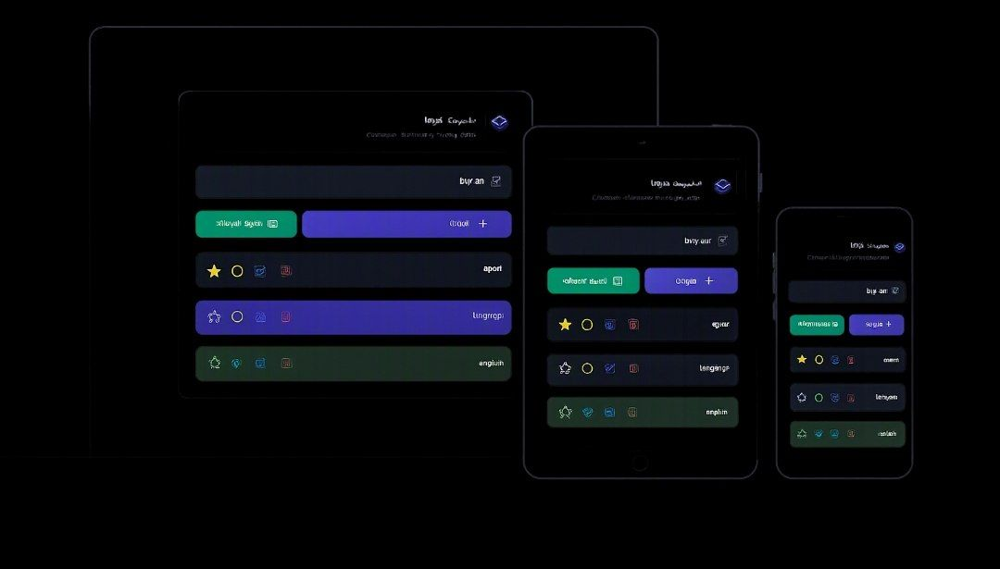

  # 📝 Task Manager | مدیریت کارها

  

    <b>A sleek, fast, and interactive Persian Task Management Web App built with Vanilla JavaScript and Modern CSS.</b>
  

  

    <a href="https://poria-dev.github.io/TODO_LIST/" target="_blank">🌐 Live Demo</a> •
    <a href="#key-features">Key Features</a> •
    <a href="#tech-stack">Tech Stack</a> •
    <a href="#getting-started">Getting Started</a> •
    <a href="#roadmap">Roadmap</a>
  

   

  <!-- App Screenshot -->
  

---

## 📌 Overview

Task Manager (مدیریت کارها) is a clean, minimal, and user-friendly web application designed to help users track and manage daily tasks efficiently. Featuring real-time status updates, active filters, and custom toast notification banners for user interactions, this project focuses on smooth DOM manipulation and clean frontend architecture.

> Note: This version utilizes In-Memory State Management (session-based). Tasks persist during the current active session without browser local storage, making it ideal for lightweight execution and demonstrating state handling logic.

---

## ✨ Key Features

* ➕ Task Creation & Deletion: Effortlessly add new tasks and remove completed ones with visual confirmations.
* 🔔 Custom Toast Notifications: Clean UI alerts confirming task actions (e.g., *"تسک با موفقیت اضافه شد"* & *"تسک با موفقیت حذف شد"*).
* 🎯 Status Filtering: Dynamic filters to view All, Active, or Completed tasks instantly.
* 📊 Task Counters: Real-time counters displaying pending and completed tasks.
* 📱 Fully Responsive UI: Optimized layout with clean typography and modern visual feedback across all device sizes.
* 🇮🇷 RTL & Persian UI Support: Tailored specifically for right-to-left layout and Persian language experience.

---

## 🛠️ Tech Stack

* HTML5: Semantic architecture with full RTL layout structure.
* CSS3: Custom styles, modern flexbox/grid layouts, smooth animations, and toast notification designs.
* JavaScript (ES6+): Dynamic DOM manipulation, state management, and custom toast triggers.

---

## 🌐 Live Demo

You can try the live application right now on GitHub Pages:  
👉 [poria-dev.github.io/TODO_LIST](https://poria-dev.github.io/TODO_LIST/)

---

## 🚀 Getting Started

To run this project locally on your system:

### 1. Clone the repository
`bash
git clone [https://github.com/poria-dev/TODO_LIST.git](https://github.com/poria-dev/TODO_LIST.git)
